# IPO & M&A News Tracker 📰

An automated news scraping and email notification system that monitors multiple financial news websites for IPO, M&A, and Demerger related articles. The system intelligently filters relevant content, prevents duplicates, and sends daily email digests to stakeholders.

## 📋 Table of Contents

- [Overview](#-overview)
- [Features](#-features)
- [System Architecture](#️-system-architecture)
- [Technical Deep Dive](#-technical-deep-dive)
- [Installation](#-installation)
- [Configuration](#️-configuration)
- [Usage](#-usage)
- [Database Schema](#️-database-schema)
- [How It Works](#-how-it-works)
- [Website-Specific Scraping Strategies](#-website-specific-scraping-strategies)
- [Keyword Matching Logic](#-keyword-matching-logic)
- [Error Handling & Resilience](#-error-handling--resilience)
- [Contributing](#-contributing)
- [License](#-license)

---

## 🎯 Overview

This project consists of two main components:

1. **News Scraper** (`Ipo_tracker.py`) - Continuously monitors 7+ financial news websites for relevant articles
2. **Email Agent** (`mail_sending_agent.py`) - Sends formatted email digests of newly discovered articles

The system is designed to run 24/7, scraping news every 90 minutes and sending email notifications whenever new articles are found.

---

## ✨ Features

### Core Capabilities

- **Multi-Source Scraping**: Monitors 7 major financial news platforms
- **Intelligent Keyword Matching**: Uses exact word boundary matching to identify relevant articles
- **Advanced Filtering**: Excludes irrelevant content (sports, entertainment, advertisements, etc.)
- **Duplicate Prevention**: Tracks articles by both title and URL to avoid redundancy
- **Category Classification**: Automatically categorizes articles into IPO, M&A, or Demerger
- **Email Notifications**: Sends HTML-formatted email digests with article links
- **Database Persistence**: Stores all articles in MySQL for historical tracking
- **Auto-Reconnection**: Handles database disconnections gracefully
- **Rate Limiting**: Implements delays to respect website servers

### Smart Features

- **Exclusion Tracking**: Reports relevant articles that were filtered out and why
- **Batch Processing**: Commits database records in batches for efficiency
- **Session Management**: Uses persistent HTTP sessions for better performance
- **Normalization**: Handles URL variations and text formatting inconsistencies

---

## 🏗️ System Architecture


---

## 🔬 Technical Deep Dive

### Scraping Process Flow


### Email Notification Flow


---

## 📦 Installation

### Prerequisites

```bash
# Python 3.7+
python --version

# MySQL Server
mysql --version
```

### Install Dependencies

```bash
pip install requests beautifulsoup4 mysql-connector-python
```

### Database Setup

```sql
CREATE DATABASE financial_news;

USE financial_news;

CREATE TABLE IPO_Scraped_Articles (
    id INT AUTO_INCREMENT PRIMARY KEY,
    Scraped_Date DATE NOT NULL,
    Website VARCHAR(100) NOT NULL,
    Keyword VARCHAR(50) NOT NULL,
    Title TEXT NOT NULL,
    Article_Link TEXT NOT NULL,
    sent_status BOOLEAN DEFAULT FALSE,
    inserted_at TIMESTAMP DEFAULT CURRENT_TIMESTAMP,
    INDEX idx_sent_status (sent_status),
    INDEX idx_scraped_date (Scraped_Date),
    INDEX idx_keyword (Keyword)
);
```

---

## ⚙️ Configuration

### Database Configuration (`Ipo_tracker.py`)
Change the values in the .env file

```python
db_config = {
    'host': os.getenv('DB_HOST'),
    'user': os.getenv('DB_USER'),
    'password': os.getenv('MYSQL_ROOT_PASSWORD'),  # or MYSQL_PASSWORD
    'database': os.getenv('DB_NAME'),
    'autocommit': False,
    'use_unicode': True,
    'charset': 'utf8mb4'
}
```

### Email Configuration (`mail_sending_agent.py`)
Change the values in .env file
```python
sender_email = os.getenv('SENDER_EMAIL')
recipient_emails = os.getenv('RECIPIENT_EMAILS') 
cc_emails = os.getenv('CC_EMAILS')

# SMTP Credentials
server.login(os.getenv('SENDER_EMAIL'),os.getenv('SENDER_PASSWORD'))
```

### Scraping Interval

Modify the wait time between scraping cycles:

```python
wait_minutes = os.getenv('SCRAPE_INTERVAL_MINUTES')  # Default: 90 minutes
```

---

## 🚀 Usage

### Running the Scraper

```bash
# Start continuous scraping
python Ipo_tracker.py

# The scraper will:
# 1. Connect to database
# 2. Load existing articles
# 3. Scrape all configured websites
# 4. Insert new articles
# 5. Wait 90 minutes
# 6. Repeat
```

### Running the Email Agent

```bash
# Send emails for unsent articles
python mail_sending_agent.py

# The agent will:
# 1. Connect to database
# 2. Fetch unsent articles
# 3. Format HTML email
# 4. Send via SMTP
# 5. Mark articles as sent
```

### Scheduling with Cron

```bash
# Edit crontab
crontab -e

# Run email agent every 2 hours
0 */2 * * * /usr/bin/python3 /path/to/mail_sending_agent.py

# Start scraper on system boot
@reboot /usr/bin/python3 /path/to/Ipo_tracker.py
```

---

## 🗄️ Database Schema


### Key Fields Explained

| Field | Purpose | Example |
|-------|---------|---------|
| `id` | Unique identifier | 1, 2, 3... |
| `Scraped_Date` | When article was discovered | 2025-11-08 |
| `Website` | Source platform | MoneyControl, ZeeBiz |
| `Keyword` | Article category | IPO, M&A, Demerger |
| `Title` | Article headline | "Company XYZ files for IPO" |
| `Article_Link` | Direct URL | https://example.com/article |
| `sent_status` | Email notification status | 0 (pending), 1 (sent) |
| `inserted_at` | Database insertion timestamp | 2025-11-08 14:30:00 |

---

## 🔍 How It Works

### 1. Duplicate Prevention


**Normalization Process:**
- Convert to lowercase
- Remove extra whitespace
- Strip URL fragments (#anchors)
- Remove query parameters (optional)

### 2. Keyword Matching Engine


**Exact Word Matching:**
Uses regex word boundaries `\b` to ensure precision:
- ✅ "IPO filing" → Matches "IPO"
- ❌ "HIPOT test" → Does NOT match "IPO"
- ✅ "Company acquired stake" → Matches "Acquired"

---

## 🌐 Website-Specific Scraping Strategies

### Complexity Matrix

```mermaid
graph TD
    subgraph "Simple Structure"
        A[MNA Critique<br/>★☆☆☆☆]
        B[Entrackr<br/>★★☆☆☆]
    end
    
    subgraph "Moderate Complexity"
        C[Livemint<br/>★★★☆☆]
        D[MoneyControl<br/>★★★☆☆]
    end
    
    subgraph "High Complexity"
        E[ZeeBiz<br/>★★★★☆]
        F[Economic Times<br/>★★★★★]
    end
    
    style A fill:#043015,stroke:#2E8A4F
    style B fill:#043015,stroke:#2E8A4F
    style C fill:#F59527,stroke:#C17D11
    style D fill:#F59527,stroke:#C17D11
    style E fill:#FF6347,stroke:#8A2E2E
    style F fill:#DC143C,stroke:#8A2E2E,stroke-width:3px
```



### Per-Website Extraction Logic

#### 1. MoneyControl (Moderate)

```python
# Multiple selector strategy for robustness
selectors = ['div.item a', 'h2 a', 'h3 a', '.news-item a', '.story-card a']
```

**Challenges:**
- Dynamic content loading
- Multiple layout variations
- Nested article structures

**Solution:** Try multiple CSS selectors sequentially until articles are found.

---

#### 2. ZeeBiz (High Complexity)

```python
# Different selectors for Economy vs General sections
if is_economy:
    selectors = ['a.swdetl-mrgn0', '.story-title a', 'h2 a']
else:
    selectors = ['h3 a', 'h2 a', '.story-title a']
```

**Challenges:**
- Two separate sections (Economy & General)
- Inconsistent HTML structure
- Class name variations

**Solution:** Maintain separate selector sets for each section type.

---

#### 3. Economic Times (Highest Complexity)

```python
# Most diverse selector set
selectors = ['article a', '.story-card a', 'h2 a', 'h3 a', '.eachStory a']
# Filter out JavaScript links
if not href.startswith('javascript:'):
    # Process article
```

**Challenges:**
- JavaScript-heavy website
- AJAX content loading
- Invalid/broken links
- Complex nested structures

**Solution:** 
- Multiple fallback selectors
- JavaScript link filtering
- Robust URL validation

---

#### 4. Entrackr (Moderate)

```python
# Handle both direct links and parent-child relationships
selectors = ['h2 a', 'h3 a', 'a h2', 'a h3', '.post-title a']
```

**Challenges:**
- Headings sometimes inside links, sometimes wrapping links
- Inconsistent structure

**Solution:** Check both patterns (heading in link, link in heading).

---

#### 5. Livemint (Moderate)

```python
selectors = ['h2.imgStory a', 'h3 a', '.story-card a', '.headline a']
# Filter anchor-only links
if not href.startswith('#'):
    # Process article
```

**Challenges:**
- Internal navigation anchors
- Image-based story cards
- Multiple content types

**Solution:** Filter out hash-only links and use class-specific selectors.

---

#### 6. MNA Critique (Simple)

```python
elements = soup.select('h2.entry-title a, .entry-title a')
```

**Challenges:** Minimal - straightforward blog structure

**Solution:** Single selector targeting entry titles.

---

## 🎯 Keyword Matching Logic

### Category Definitions

```python
keyword_mapping = {
    "IPO": ["IPO", "Initial Public Offering"],
    
    "M&A": ["M&A", "Merger & Acquisition", "Merged", "Acquired", 
            "Merger", "Acquires", "Merge", "Acquisition", 
            "Merges", "Acquiring", "Merging"],
    
    "Demerger": ["Demerger", "Demerged", "Demerging", "Demerges", 
                 "Demerge", "Demergers", "Separate", "Separation", 
                 "Restructure", "Restructuring", "Restructures"]
}
```

### Exclusion Keywords

```python
exclusion_keywords = [
    # Marketing
    "advertisement", "ads", "sponsored", "promotion",
    
    # Entertainment
    "horoscope", "astrology", "cricket", "sports", 
    "bollywood", "entertainment", "celebrity", "movie",
    
    # Lifestyle
    "fashion", "lifestyle", "travel", "food", "recipe",
    "health tips", "fitness", "yoga",
    
    # Promotional
    "quiz", "contest", "giveaway", "discount", "offer",
    "sale", "shopping", "deals", "coupons",
    
    # Generic
    "Day", "Open"
]
```

### Matching Process


---

## 🛡️ Error Handling & Resilience

### Multi-Layer Error Protection


### Error Scenarios Handled

| Error Type | Detection | Recovery Strategy | Impact |
|------------|-----------|-------------------|---------|
| **Database Disconnect** | `db.is_connected()` | Auto-reconnect with retry | Minimal - Automatic recovery |
| **Website Timeout** | 15-second timeout | Skip site, continue scraping | Single site skipped |
| **HTTP Errors** | Status code check | Log & skip | Single site skipped |
| **Invalid HTML** | Content-type validation | Skip to next site | Single site skipped |
| **Duplicate Key** | Try-catch on INSERT | Rollback, continue | Article skipped |
| **SMTP Failure** | Exception handling | Log error, retry next cycle | Email delayed |
| **Memory Overflow** | Batch commits (10 articles) | Frequent commits | Reduced memory usage |

---

## 📊 Performance Metrics

### Scraping Performance


**Typical Run Statistics:**
- Total articles processed: 300-400
- Relevant articles found: 8-15
- Duplicates skipped: 5-10
- New articles inserted: 2-8
- Execution time: 2-4 minutes

### Rate Limiting Strategy

```python
# Between article batches
if len(scraped_articles) % 10 == 0:
    time.sleep(30)  # 30 seconds

# Between websites
time.sleep(2)  # 2 seconds

# Between scraping cycles
time.sleep(90 * 60)  # 90 minutes
```

---

## 📧 Email Format Example

```html
<table border='1'>
    <tr>
        <th>ID</th>
        <th>Date</th>
        <th>Website</th>
        <th>Category</th>
        <th>Heading</th>
        <th>Link</th>
    </tr>
    <tr>
        <td>123</td>
        <td>2025-11-08</td>
        <td>MoneyControl</td>
        <td>IPO</td>
        <td>Tech Startup Files for IPO</td>
        <td><a href="...">View Article</a></td>
    </tr>
</table>
```

---

## 🔧 Troubleshooting

### Common Issues

**1. Database Connection Failed**
```bash
# Check MySQL service
sudo systemctl status mysql

# Test connection
mysql -u root -p -h localhost
```

**2. No Articles Found**
- Verify website URLs are accessible
- Check if HTML structure has changed
- Review CSS selectors in extraction functions

**3. Email Not Sending**
- Verify SMTP credentials
- Check firewall rules for port 587
- Ensure sender email has SMTP access enabled

**4. High CPU Usage**
- Increase sleep intervals
- Reduce number of websites
- Optimize database queries

---

## 🚀 Future Enhancements

- [ ] Add more news sources
- [ ] Implement machine learning for better categorization
- [ ] Create web dashboard for article management
- [ ] Add Telegram/Slack notifications
- [ ] Implement article sentiment analysis
- [ ] Add full-text article extraction
- [ ] Create API endpoints for external access
- [ ] Add user preference management
- [ ] Implement article deduplication across sources
- [ ] Add performance monitoring dashboard

---

## 🤝 Contributing

Contributions are welcome! Please follow these steps:

1. Fork the repository
2. Create a feature branch (`git checkout -b feature/amazing-feature`)
3. Commit your changes (`git commit -m 'Add amazing feature'`)
4. Push to the branch (`git push origin feature/amazing-feature`)
5. Open a Pull Request

---

## 📄 License

This project is proprietary software developed for internal use at.

---

## 📞 Contact

For questions or support, contact:
- Email: akashwillstudy@gmail.com

---

## 🙏 Acknowledgments

- **BeautifulSoup4** - HTML parsing
- **Requests** - HTTP library
- **MySQL** - Database management
- **Python SMTP** - Email delivery

---

**Made with ❤️ for efficient financial news tracking**